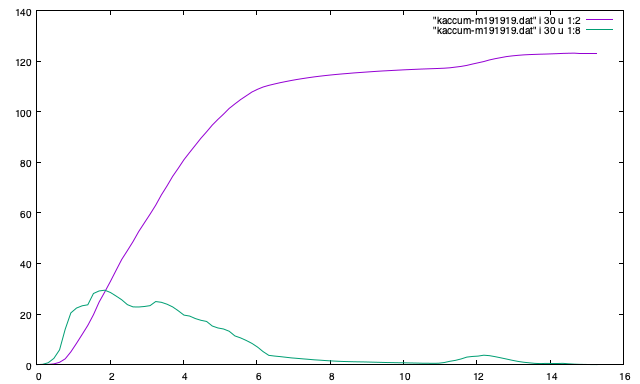
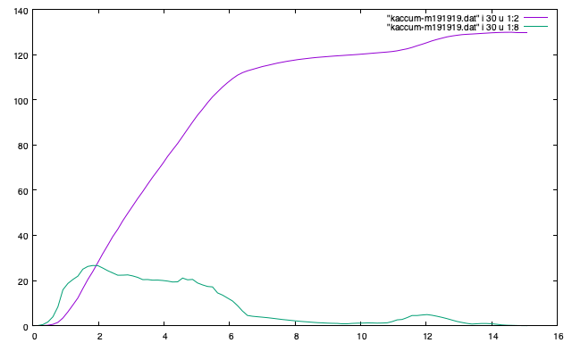
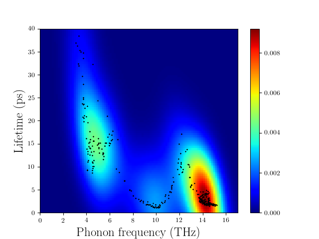
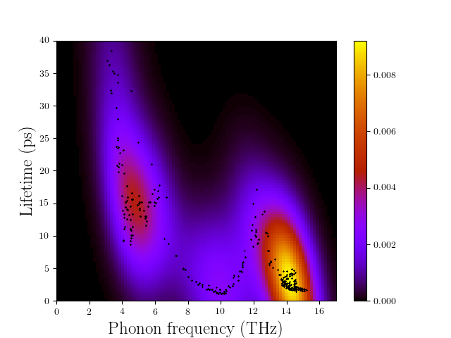
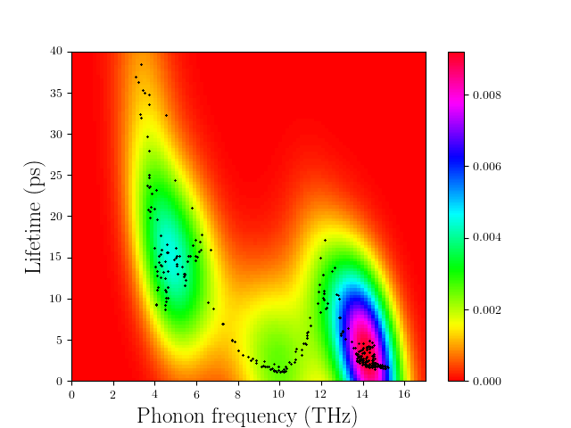
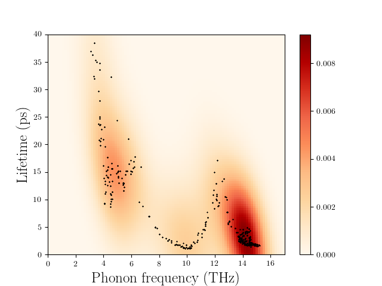

.. _auxiliary_tools:

Auxiliary tools
===============

.. contents::
   :depth: 3
   :local:

.. _auxiliary_tools_kaccum:

``phono3py-kaccum``
--------------------

Cumulative physical properties with respect to frequency or mean free
path are calculated using this command.

For example, cumulative thermal conductivity is defined by

.. math::

   \kappa^\text{c}(\omega) =
    \int^\omega_0 \frac{1}{N} \sum_\lambda
   \kappa_\lambda \delta(\omega_\lambda - \omega') d\omega'

:math:`\kappa_\lambda` is the contribution to :math:`\kappa` from the
phonon mode :math:`\lambda`, which is defined as

.. math::

   \kappa_\lambda = \frac{1}{V_0}
   C_\lambda \mathbf{v}_\lambda \otimes \mathbf{v}_\lambda
   \tau_\lambda.

(The notations are found in http://arxiv.org/abs/1501.00691.)

How to use ``phono3py-kaccum``
~~~~~~~~~~~~~~~~~~~~~~~~~~~~~~~

Let's computer lattice thermal conductivity of Si using the ``Si-PBEsol``
example found in the example directory.

::

   % phono3py --dim="2 2 2" --pa="0 1/2 1/2 1/2 0 1/2 1/2 1/2 0" -c POSCAR-unitcell --mesh="11 11 11" --sym-fc --br

Then using the output file, ``kappa-m111111.hdf5``, run
``phono3py-kaccum`` as follows::

   % phono3py-kaccum --pa="0 1/2 1/2 1/2 0 1/2 1/2 1/2 0" -c POSCAR-unitcell kappa-m111111.hdf5 |tee kaccum.dat

Here ``--pa`` is optional. The definition of ``--pa`` option is same
as :ref:`pa_option`. ``POSCAR-unitcell`` is the unit cell filename
that is specified with ``-c`` option.  ``kappa-m111111.hdf5`` is the
output file of thermal conductivity calculation, which is passed to
``phono3py-kaccum`` as the first argument.

The format of the output is as follows: The first column gives
frequency in THz, and the second to seventh columns give the
cumulative lattice thermal conductivity of 6 elements, xx, yy, zz, yz,
xz, xy. The eighth to 13th columns give the derivatives. There are
sets of frequencies, which are separated by blank lines. Each set is
for a temperature. There are the groups corresponding to the number of
temperatures calculated.

To plot the output by gnuplot at temperature index 30 that may
correspond to 300 K,

::

   % gnuplot
   ...
   gnuplot> p "kaccum.dat" i 30 u 1:2 w l, "kaccum.dat" i 30 u 1:8 w l

The plot like below is displayed.

.. |Si-kaccum| image:: Si-kaccum.png
        :width: 50%

|Si-kaccum|

With :math:`19\times 19\times 19` mesh:

|Si-kaccum-m191919|

General options
~~~~~~~~~~~~~~~~

``--pa``
^^^^^^^^^

See :ref:`pa_option`.

``-c``
^^^^^^^

Unit cell filename is specified with this option, e.g., ``-c
POSCAR-unitcell``.

``--qe``
^^^^^^^^

Let ``phono3py-kaccum`` read a QE (pw) unit cell file with ``-c``
option, for example::

   phono3py-kaccum --qe --pa="0 1/2 1/2 1/2 0 1/2 1/2 1/2 0" -c Si.in kappa-m191919.hdf5

|ipwscf|

``--crystal``
^^^^^^^^^^^^^

Analogous to ``--qe``, but to be used with the CRYSTAL interface.

``--turbomole``
^^^^^^^^^^^^^^^

Analogous to ``--qe``, but to be used with the TURBOMOLE interface

``--temperature``
^^^^^^^^^^^^^^^^^^

Pick up one temperature point. For example, ``--temperature=300`` for
300 K, which works only if thermal conductivity is calculated at
temperatures including 300 K.

``--nsp``
^^^^^^^^^^

Number of points to be sampled in the x-axis.

Options for tensor properties
~~~~~~~~~~~~~~~~~~~~~~~~~~~~~~

For cummulative thermal conductivity, the last value is given as the
thermal conductivity in W/mK. For the other properties, the last value
is effectively the sum of values on all mesh grids divided by number
of mesh grids. This is understood as normalized for one primitive
cell. Before version 1.11.13.1, the last value for gv_by_gv (--gv
option) was further divided by the primitive cell volume.

Number of columns of output data is 13 as explained above. With
``--average`` and ``--trace`` options, number of columns of output
data becomes 3.

``--mfp``
^^^^^^^^^^

Mean free path (MFP) is used instead of frequency for the x-axis. MFP
is defined in the single-mode RTA by a vector

.. math::

   \mathbf{l}_\lambda = \mathbf{v}_\lambda \tau_\lambda.

The MFP cumulative :math:`\kappa^\text{c}(l)` is given by

.. math::

   \kappa^\text{c}(l) =
    \int^l_0 \frac{1}{N} \sum_\lambda
   \kappa_\lambda \delta(l_\lambda - l') dl'

where :math:`l_\lambda = |\mathbf{l}_\lambda|` and
:math:`\kappa_\lambda` is the contribution to :math:`\kappa` from the
phonon mode :math:`\lambda` in the single-mode RTA, which is defined
as

.. math::

   \kappa_\lambda = \frac{1}{V_0} C_\lambda \mathbf{v}_\lambda \otimes
   \mathbf{v}_\lambda \tau_\lambda = \frac{1}{V_0} C_\lambda
   \mathbf{v}_\lambda \otimes \mathbf{l}_\lambda.

The physical unit of MFP is Angstrom.

The figure below shows the results of Si example with the
:math:`19\times 19\times 19` and :math:`11\times 11\times 11` sampling
meshes used for the lattice thermal conductivity calculation. They look
differently. Especially for the result of the :math:`11\times 11\times
11` sampling mesh, the MFP seems converging but we can see it's not
true to look at that of the :math:`19\times 19\times 19` sampling
mesh. To show this type of plot, be careful about the sampling mesh
convergence.

.. |iMFP| image:: Si-kaccum-MFP.png
                  :width: 50%

|iMFP|

(This plot is based on the ``Si-PBEsol`` example.)

``--gv``
^^^^^^^^^

Outer product of group velocities :math:`\mathbf{v}_\lambda \otimes
\mathbf{v}_\lambda` divided by primitive cell volume (in :math:`\text{THz}^2 /
\text{Angstrom}`)

``--average``
^^^^^^^^^^^^^^

Output the traces of the tensors divided by 3 rather than the unique
elements.

``--trace``
^^^^^^^^^^^^

Output the traces of the tensors rather than the unique elements.

Options for scalar properties
~~~~~~~~~~~~~~~~~~~~~~~~~~~~~~

For the following properties, those values are normalized by the
number of full grid points. This is understood as normalized for one
primitive cell.

Number of columns of output data is three,
frequency, cumulative property, and derivative of cumulative property
such like DOS.

``--gamma``
^^^^^^^^^^^^

:math:`\Gamma_\lambda(\omega_\lambda)` (in THz)

``--tau``
^^^^^^^^^^^

Lifetime :math:`\tau_\lambda = \frac{1}{2\Gamma_\lambda(\omega_\lambda)}` (in ps)

``--cv``
^^^^^^^^^

Modal heat capacity :math:`C_\lambda` (in eV/K)

``--gv-norm``
^^^^^^^^^^^^^^

Absolute value of group velocity :math:`|\mathbf{v}_\lambda|` (in
:math:`\text{THz}\cdot\text{Angstrom}`)

``--pqj``
^^^^^^^^^^^^^^

Averaged phonon-phonon interaction :math:`P_{\mathbf{q}j}` (in :math:`\text{eV}^2`)

.. _auxiliary_tools_kdeplot:

``phono3py-kdeplot``
---------------------

**This script is under the development and may contain bugs.** But a
feature is briefly introduced below since it may be useful. Scipy is
needed to use this script.

This script draws density of phonon modes in the frequency-lifetime
plane. Its density is estimated using Gaussian-KDE using `scipy
<https://docs.scipy.org/doc/scipy/reference/generated/scipy.stats.gaussian_kde.html>`_.
Then (frequency, lifetime)-data points are superimposed on the density
plot.

``phono3py-kdeplot`` reads a result of the thermal conductivity
calculation as the first argument::

   % phono3py-kdeplot kappa-m111111.hdf5

This calculation takes some time from minutes to hours depending on
mesh numbers and nbins. Therefore it is recommended to start with
smaller mesh and gradually to increase mesh numbers and nbins up to
satisfaction.

After finishing the calculation, the plot is saved in
``lifetime.png``. The black dots show original data points. The
drawing area is automatically set to make the look good, where its
higher lifetime side is not drawn if all density beyond a lifetime
value is smaller than some ratio (see
:ref:`kdeplot_density_ratio`) of the maximum density.

The following plot is drawn with a 19x19x19 mesh and nbins=200 and the
``Si-PBEsol`` example is used to generate the data. The colormap of
'jet' in matplotlib is used.

.. |ikde| image:: Si-kdeplot.png
        :width: 50%

|ikde|

Options
~~~~~~~

``--temperature``
^^^^^^^^^^^^^^^^^^

Pick up one temperature point. For example, ``--temperature=300`` for
300 K, which works only if thermal conductivity is calculated at
temperatures including 300 K.

Without specifying this option, the 31st temperature index is
chosen. This often corresponds to 300 K if phono3py ran without
setting temperature range and step.

``--nbins``
^^^^^^^^^^^^

This option controls the resolution of the density plot. The default
value is 100. With larger nbins, the resolution of the plot becomes
better, but the computation will take more time.

::

   % phono3py-kdeplot --nbins=200 kappa-m111111.hdf5

``--cutoff``, ``--fmax``
^^^^^^^^^^^^^^^^^^^^^^^^^^

The option ``--cutoff`` (``--fmax``) sets the maximum value of
lifetime (frequency) to be included as data points **before**
Gaussian-KDE. Normally increasing this value from the chosen value
without specifying this option does nothing since automatic control of
drawing area cuts high lifetime (frequency) side if the density is low.

``--xmax`` and ``--ymax``
^^^^^^^^^^^^^^^^^^^^^^^^^^

Maximum values of drawing region of phonon frequency (x-axis) and
lifetime (y-axis) are specified by ``--xmax`` and ``--ymax``,
respectively.

``--ymax`` switches off automatic determination of maximum value
of drawing region along y-axis, therefore as a side effect, the
computation will be roughly twice faster.

::

   % phono3py-kdeplot --ymax=60 kappa-m111111.hdf5

``--zmax``
^^^^^^^^^^^

Maximum value of the density is specified with this option. The color
along colorbar saturates by choosing a smaller value than the maximum value
of density in the data.

.. _kdeplot_density_ratio:

``--dr``, ``--density-ratio``
^^^^^^^^^^^^^^^^^^^^^^^^^^^^^^

The density threshold is specified by the ratio with respect to
maximum density. Normally smaller value results in larger drawing
region. The default value is 0.1. When ``--ymax`` is specified
together, this option is ignored.

::

   % phono3py-kdeplot --dr=0.01 kappa-m111111.hdf5

``--cmap``
^^^^^^^^^^^

Color map to be used for the density plot. It's given by the name
presented at the matplotlib documentation,
https://matplotlib.org/users/colormaps.html. The default colormap
depends on your matplotlib environment.

::

   % phono3py-kdeplot --cmap="OrRd" kappa-m111111.hdf5

The following figures are those drawn with ``jet``, ``bwr``,
``seismic``, ``gnuplot``, ``hsv``, and ``OrRd`` colormaps.

.. |ikde-bwr| image:: Si-kdeplot-bwr.png
              :width: 25%
.. |ikde-seismic| image:: Si-kdeplot-seismic.png
                  :width: 25%

|ikde-jet| |ikde-bwr| |ikde-seismic| |ikde-gnuplot| |ikde-hsv| |ikde-OrRd|
