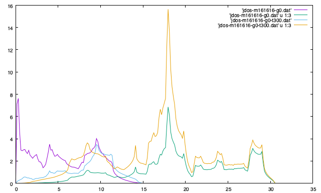

.. _command_options:

Command options / Setting tags
=================================

Phono3py is operated with command options or with a configuration file
that contains setting tags. In this page, the command options are
explained. Most of command options have their respective setting
tags.

A configuration file with setting tags like phonopy can be used
instead of and together with the command options. The setting tags are
mostly equivalent to the respective most command options, but when
both are set simultaneously, the command options are preferred. An
example of configuration (e.g., saved in a file ``setting.conf``) is
as follow::

   DIM = 2 2 2
   DIM_FC2 = 4 4 4
   PRIMITIVE_AXES = 0 1/2 1/2 1/2 0 1/2 1/2 1/2 0
   MESH = 11 11 11
   BTERTA = .TRUE.
   NAC = .TRUE.
   READ_FC2 = .TRUE.
   READ_FC3 = .TRUE.
   CELL_FILENAME = POSCAR-unitcell

where the setting tag names are case insensitive. This is run by

::

   % phono3py setting.conf [comannd options]

or

::

   % phono3py [comannd options] -- setting.conf

.. contents::
   :depth: 2
   :local:

Input cell file name
--------------------

``-c`` (``CELL_FILENAME``)
~~~~~~~~~~~~~~~~~~~~~~~~~~

This specifies input unit cell filename.

::

   % phono3py -c POSCAR-unitcell ... (many options)

Calculator interface
---------------------

``--qe`` (``CALCULATOR = QE``)
~~~~~~~~~~~~~~~~~~~~~~~~~~~~~~

Quantum espresso (pw) interface is invoked.
See the detail at :ref:`qe_interface`.

``--crystal`` (``CALCULATOR = CRYSTAL``)
~~~~~~~~~~~~~~~~~~~~~~~~~~~~~~~~~~~~~~~~

CRYSTAL interface is invoked.
See the detail at :ref:`crystal_interface`.

``--turbomole`` (``CALCULATOR = TURBOMOLE``)
~~~~~~~~~~~~~~~~~~~~~~~~~~~~~~~~~~~~~~~~~~~~

TURBOMOLE interface is invoked.
See the details at :ref:`turbomole_interface`.

Utilities to create default input files
----------------------------------------

These options have no respective configuration file tags.

``--cf3`` (command option only)
~~~~~~~~~~~~~~~~~~~~~~~~~~~~~~~

This is used to create ``FORCES_FC3`` from ``disp_fc3.yaml`` and
force calculator outputs containing forces in supercells. ``disp_fc3.yaml``
has to be located at the current directory. Calculator interface has
to be specified except for VASP (default) case.

::

   % phono3py --cf3 disp-{00001..00755}/vasprun.xml

::

   % phono3py --qe --cf3 supercell_out/disp-{00001..00111}/Si.out

.. _cf3_file_option:

``--cf3-file`` (command option only)
~~~~~~~~~~~~~~~~~~~~~~~~~~~~~~~~~~~~

This is used to create ``FORCES_FC3`` from a text file containing a
list of calculator output file names. ``disp_fc3.yaml`` has to be
located at the current directory. Calculator interface has to be
specified except for VASP (default) case.

::

   % phono3py --cf3-file file_list.dat

where ``file_list.dat`` contains file names that can be recognized
from the current directory and is expected to be like::

  disp-00001/vasprun.xml
  disp-00002/vasprun.xml
  disp-00003/vasprun.xml
  disp-00004/vasprun.xml
  ...

The order of the file names is important. This option may be useful
to be used together with ``--cutoff-pair`` option.

.. _cf2_option:

``--cf2`` (command option only)
~~~~~~~~~~~~~~~~~~~~~~~~~~~~~~~

This is used to create ``FORCES_FC2`` similarly to ``--cf3``
option. ``disp_fc2.yaml`` has to be located at the current
directory. This is optional. Calculator interface has to be specified
except for VASP (default) case. ``FORCES_FC2`` is necessary to run
with ``--dim-fc2`` option.

::

   % phono3py --cf2 disp_fc2-{00001..00002}/vasprun.xml

.. _cfz_option:

``--cfz`` (command option only)
~~~~~~~~~~~~~~~~~~~~~~~~~~~~~~~~~

This is used to create ``FORCES_FC3`` and ``FORCES_FC2`` subtracting
residual forces combined with ``--cf3`` and ``--cf2``,
respectively. Calculator interface has to be specified except for VASP
(default) case.

In the following example, it is supposed that
``disp3-00000/vasprun.xml`` and ``disp2-00000/vasprun.xml`` contain
the forces of the perfect supercells. In ideal case, these forces are
zero, but often they are not. Here, this is called "residual
forces". Sometimes quality of force constants is improved in this way.

::

   % phono3py --cf3 disp3-{00001..01254}/vasprun.xml --cfz disp3-00000/vasprun.xml
   % phono3py --cf2 disp2-{00001..00006}/vasprun.xml --cfz disp2-00000/vasprun.xml

.. _fs2f2_option:

``--fs2f2`` or ``--force-sets-to-forces-fc2`` (command option only)
~~~~~~~~~~~~~~~~~~~~~~~~~~~~~~~~~~~~~~~~~~~~~~~~~~~~~~~~~~~~~~~~~~~~~

``FORCES_FC2`` and ``disp_fc2.yaml`` are created
from phonopy's ``FORCE_SETS`` file.

::

   % phono3py --fs2f2

.. _cfs_option:

``--cfs`` or ``--create-force-sets`` (command option only)
~~~~~~~~~~~~~~~~~~~~~~~~~~~~~~~~~~~~~~~~~~~~~~~~~~~~~~~~~~~

Phonopy's ``FORCE_SETS`` is created from
``FORCES_FC3`` and ``disp_fc3.yaml``.

::

   % phono3py --cfs

In conjunction with :ref:`--dim-fc2 <dim_fc2_option>`, phonopy's
``FORCE_SETS`` is created from ``FORCES_FC2`` and ``disp_fc2.yaml``
instead of ``FORCES_FC3`` and ``disp_fc3.yaml``.

::

   % phono3py --cfs --dim-fc2="x x x"

Supercell and primitive cell
----------------------------

.. _dim_option:

``--dim`` (``DIM``)
~~~~~~~~~~~~~~~~~~~

Supercell dimension is specified. See the
detail at http://phonopy.github.io/phonopy/setting-tags.html#dim .

.. _dim_fc2_option:

``--dim-fc2`` (``DIM_FC2``)
~~~~~~~~~~~~~~~~~~~~~~~~~~~

Supercell dimension for 2nd order force constants (for harmonic
phonons) is specified. This is optional.

A larger and different supercell size for 2nd order force constants
than that for 3rd order force constants can be specified with this
option. Often interaction between a pair of atoms has longer range in
real space than interaction among three atoms. Therefore to reduce
computational demand, choosing larger supercell size only for 2nd
order force constants may be a good idea.

Using this option with ``-d`` option, the structure files
(e.g. ``POSCAR_FC2-xxxxx`` or equivalent files for the other
interfaces) and ``disp_fc2.yaml`` are created. These are used to
calculate 2nd order force constants for the larger supercell size and
these force calculations have to be done in addition to the usual
force calculations for 3rd order force constants.

::

   phono3py -d --dim="2 2 2" --dim-fc2="4 4 4" -c POSCAR-unitcell

After the force calculations, ``--cf2`` option is used to create
``FORCES_FC2``.

::

   phono3py --cf2 disp-{001,002}/vasprun.xml

To calculate 2nd order force constants for the larger supercell size,
``FORCES_FC2`` and ``disp_fc2.yaml`` are necessary. Whenever running
phono3py for the larger 2nd order force constants, ``--dim-fc2``
option has to be specified. ``fc2.hdf5`` created as a result of
running phono3py contains the 2nd order force constants with
larger supercell size. The filename is the same as that created in the
usual phono3py run without ``--dim-fc2`` option.

::

   phono3py --dim="2 2 2" --dim_fc2="4 4 4" -c POSCAR-unitcell ... (many options)

.. _pa_option:

``--pa``, ``--primitive-axes`` (``PRIMITIVE_AXES``)
~~~~~~~~~~~~~~~~~~~~~~~~~~~~~~~~~~~~~~~~~~~~~~~~~~~

Transformation matrix from a non-primitive cell to the primitive
cell. See phonopy ``PRIMITIVE_AXES`` tag (``--pa`` option) at
http://phonopy.github.io/phonopy/setting-tags.html#primitive-axis

Displacement creation
---------------------

.. _create_displacements_option:

``-d`` (``CREATE_DISPLACEMENTS = .TRUE.``)
~~~~~~~~~~~~~~~~~~~~~~~~~~~~~~~~~~~~~~~~~~

Supercell with displacements are created. Using with ``--amplitude``
option, atomic displacement distances are controlled. With this
option, files for supercells with displacements and ``disp_fc3.yaml``
file are created.

.. _amplitude_option:

``--amplitude`` (``DISPLACEMENT_DISTANCE``)
~~~~~~~~~~~~~~~~~~~~~~~~~~~~~~~~~~~~~~~~~~~

Atomic displacement distance is specified.  This
value may be increased for the weak interaction systems and descreased
when the force calculator is numerically very accurate.

The default value depends on calculator. See
:ref:`default_displacement_distance_for_calculator`.

Force constants
----------------

.. _compact_fc_option:

``--cfc`` or ``--compact-fc`` (``COMPACT_FC = .TRUE.``)
~~~~~~~~~~~~~~~~~~~~~~~~~~~~~~~~~~~~~~~~~~~~~~~~~~~~~~~

When creating force constants from ``FORCES_FC3`` and/or
``FORCES_FC2``, force constants that use smaller data size are
created. The shape of the data array is ``(num_patom, num_satom)`` for
fc2 and ``(num_patom, num_satom, num_satom)`` for fc3, where
``num_patom`` and ``num_satom`` are the numbers of atoms in primtive
cell and supercell. In the full size force constants case,
``num_patom`` is replaced by ``num_satom``. Therefore if the supercell
dimension is large, this reduction of data size becomes large.  If the
input crystal structure has centring :ref:`--pa <pa_option>` is
necessary to have smallest data size. In this case, ``--pa`` option
has to be specified on reading. Otherwise phono3py can recognize if
``fc2.hdf5`` and ``fc3.hdf5`` are compact or full automatically. When
using with ``--sym-fc``, the calculated results will become slightly
different due to imperfect symmetrization scheme that phono3py
employs.

::

   % phono3py --dim="2 2 2" --cfc --pa="0 1/2 1/2 1/2 0 1/2 1/2 1/2 0" -c POSCAR-unitcell

.. _symmetrization_option:

``--sym-fc`` (``FC_SYMMETRY = .TRUE.``)
~~~~~~~~~~~~~~~~~~~~~~~~~~~~~~~~~~~~~~~

Second- and third-order force constants are symmetrized. The index
exchange of real space force constantsand translational invariance
symmetry are applied in a simple way. This symmetrization just removes
drift force constants evenly from all elements and then applies
averaging index-exchange equivalent elements. Therefore the different
symmetries are not simultaneously enforced. For better symmetrization,
it is recommended to use an external force constants calculator like ALM.

The symmetrizations for the second and third orders can be
independently applied by ``--sym-fc2`` (``SYMMETRIZE_FC2 = .TRUE.``)
and ``--sym-fc3r`` (``SYMMETRIZE_FC3 = .TRUE.``), , respectively.

..
   ``--sym-fc3q`` symmetrizes third-order force constants in normal
   coordinates by the index exchange.

.. _cf3_option:

``--cutoff-fc3`` or ``--cutoff-fc3-distance`` (``CUTOFF_FC3_DISTANCE``)
~~~~~~~~~~~~~~~~~~~~~~~~~~~~~~~~~~~~~~~~~~~~~~~~~~~~~~~~~~~~~~~~~~~~~~~~

This option is **not** used to reduce number of supercells with
displacements, but this option is used to set zero in elements of
given third-order force constants. The zero elements are selected by
the condition that any pair-distance of atoms in each atom triplet is
larger than the specified cut-off distance.

If one wants to reduce number of supercells, the first choice is to
reduce the supercell size and the second choice is using
``--cutoff-pair`` option.

.. _cutoff_pair_option:

``--cutoff-pair`` or ``--cutoff-pair-distance`` (``CUTOFF_PAIR_DISTANCE``)
~~~~~~~~~~~~~~~~~~~~~~~~~~~~~~~~~~~~~~~~~~~~~~~~~~~~~~~~~~~~~~~~~~~~~~~~~~

This option is only used together with ``-d`` option.

A cutoff pair-distance in a supercell is used to reduce the number of
necessary supercells with displacements to obtain third order force
constants. As the drawback, a certain number of
third-order-force-constants elements are abandoned or computed with
less numerical accuracy. More details are found in the following link:

.. toctree::
   :maxdepth: 1

   cutoff-pair

Reciprocal space sampling mesh and grid points, and band indices
-----------------------------------------------------------------

``--mesh`` (``MESH`` or ``MESH_NUMBERS``)
~~~~~~~~~~~~~~~~~~~~~~~~~~~~~~~~~~~~~~~~~

Mesh sampling grids in reciprocal space are generated with the
specified numbers. This mesh is made along reciprocal axes and
is always Gamma-centered. Except for that this mesh is always
Gamma-centered, this works in the same way as written here,
https://phonopy.github.io/phonopy/setting-tags.html#mesh-mp-or-mesh-numbers.

..
   ``--md``
   ~~~~~~~~~

   Divisors of mesh numbers. Another sampling mesh is used to calculate
   phonon lifetimes. :math:`8\times 8\times 8` mesh is used for the
   calculation of phonon lifetimes when it is specified, e.g.,
   ``--mesh="11 11 11" --md="2 2 2"``.

.. _gp_option:

``--gp`` (``GRID_POINTS``)
~~~~~~~~~~~~~~~~~~~~~~~~~~

Grid points are specified by their unique indices, e.g., for selecting
the q-points where imaginary parts of self energees are
calculated. For thermal conductivity calculation, this can be
used to distribute its calculation over q-points (see
:ref:`workload_distribution`).

Indices of grid points are specified by space or comma (``,``)
separated numbers. The mapping table between grid points to its
indices is obtained by running with ``--loglevel=2`` option.

::

   % phono3py --dim="2 2 2" --pa="0 1/2 1/2 1/2 0 1/2 1/2 1/2 0" -c POSCAR-unitcell --mesh="19 19 19" --fc3 --fc2 --br --write-gamma --gp="0 1 2 3 4 5"

where ``--gp="0 1 2 3 4 5"`` can be also written
``--gp="0,1,2,3,4,5"``. ``--ga`` option below can be used similarly
for the same purpose.

.. _ga_option:

``--ga`` (``GRID_ADDRESSES``)
~~~~~~~~~~~~~~~~~~~~~~~~~~~~~

This is used to specify grid points like ``--gp`` option but in their
addresses represented by integer numbers. For example with
``--mesh="16 16 16"``, a q-point of (0.5, 0.5, 0.5) is given by
``--ga="8 8 8"``. The values have to be integers. If you want to
specify the point on a path, ``--ga="0 0 0 1 1 1 2 2 2 3 3 3 ..."``,
where each three values are recogninzed as a grid point. The grid
points given by ``--ga`` option are translated to grid point indices
as given by ``--gp`` option, and the values given by ``--ga`` option
will not be shown in log files.

.. _bi_option:

``--bi`` (``BAND_INDICES``)
~~~~~~~~~~~~~~~~~~~~~~~~~~~

Band indices are specified. The output file name will be, e.g.,
``gammas-mxxx-gxx(-sx)-bx.dat`` where ``bxbx...`` shows the band
indices used to be averaged. The calculated values at indices
separated by space are averaged, and those separated by comma are
separately calculated.

::

   % phono3py --fc3 --fc2 --dim="2 2 2" --mesh="16 16 16" -c POSCAR-unitcell --nac --gp="34" --bi="4 5, 6"

This may be also useful to distribute the computational demand
such like that the unit cell is large and the calculation of
phonon-phonon interaction is heavy.

.. _wgp_option:

``--wgp`` (command option only)
~~~~~~~~~~~~~~~~~~~~~~~~~~~~~~~~

Irreducible grid point indices and related information are written
into ``ir_grid_points.yaml``. This information may be used when we
want to distribute thermal conductivity calculation into small pieces
or to find specific grid points to calculate imaginary part of self
energy, for which :ref:`--gp option <gp_option>` can be used to
specify the grid point indices.

``grid_address-mxxx.hdf5`` is also written. This file contains all the
grid points and their grid addresses in integers. Q-points
corresponding to grid points are calculated divided these integers by
sampling mesh numbers for respective reciprocal axes.

::

   % phono3py --dim="2 2 2" --pa="0 1/2 1/2 1/2 0 1/2 1/2 1/2 0" -c POSCAR-unitcell --mesh="19 19 19" --wgp

.. _stp_option:

``--stp`` (command option only)
~~~~~~~~~~~~~~~~~~~~~~~~~~~~~~~~

Numbers of q-point triplets to be calculated for irreducible grid
points for specified sampling mesh numbers are shown. This can be used
to estimate how large a calculation is. Only those for specific grid
points are shown by using with ``--gp`` or ``--ga`` option.

::

   % phono3py --dim="2 2 2" --pa="0 1/2 1/2 1/2 0 1/2 1/2 1/2 0" -c POSCAR-unitcell --mesh="19 19 19" --stp --gp 20

Brillouin zone integration
---------------------------

.. _thm_option:

``--thm`` (``TETRAHEDRON = .TRUE.``)
~~~~~~~~~~~~~~~~~~~~~~~~~~~~~~~~~~~~

Tetrahedron method is used for calculation of imaginary part of self
energy. This is the default option. Therefore it is not necessary to
specify this unless both results by tetrahedron method and
smearing method in one time execution are expected.

.. _sigma_option:

``--sigma`` (``SIGMA``)
~~~~~~~~~~~~~~~~~~~~~~~

:math:`\sigma` value of Gaussian function for smearing when
calculating imaginary part of self energy. See the detail at
:ref:`brillouinzone_sum`.

Multiple :math:`\sigma` values are also specified by space separated
numerical values. This is used when we want to test several
:math:`\sigma` values simultaneously.

.. _sigma_cutoff_option:

``--sigma-cutoff`` (``SIGMA_CUTOFF_WIDTH``)
~~~~~~~~~~~~~~~~~~~~~~~~~~~~~~~~~~~~~~~~~~~

The tails of the Gaussian functions that are used to replace delta
functions in the equation shown at :ref:`--full-pp <full_pp_option>`
are cut with this option. The value is specified in number of standard
deviation. ``--sigma-cutoff=5`` gives the Gaussian functions to be cut
at :math:`5\sigma`. Using this option scarifies the numerical
accuracy. So the number has to be carefully tested. But computation of
phonon-phonon interaction strength becomes much faster in exchange for
it.

.. _full_pp_option:

``--full-pp`` (``FULL_PP = .TRUE.``)
~~~~~~~~~~~~~~~~~~~~~~~~~~~~~~~~~~~~

For thermal conductivity calculation using the linear tetrahedron
method (from version 1.10.5) and smearing method with
``--simga-cutoff`` (from version 1.12.3), only necessary elements
(i.e., that have non-zero delta functions) of phonon-phonon interaction strength,
:math:`\bigl|\Phi_{-\lambda\lambda'\lambda''}\bigl|^2`, is calculated
due to delta functions in calculation of
:math:`\Gamma_\lambda(\omega)`,

.. math::

   \Gamma_\lambda(\omega) = \frac{18\pi}{\hbar^2}
    \sum_{\lambda' \lambda''}
    \bigl|\Phi_{-\lambda\lambda'\lambda''}\bigl|^2
    \left\{(n_{\lambda'}+ n_{\lambda''}+1)
     \delta(\omega-\omega_{\lambda'}-\omega_{\lambda''}) \right.
     + (n_{\lambda'}-n_{\lambda''})
    \left[\delta(\omega+\omega_{\lambda'}-\omega_{\lambda''})
   - \left. \delta(\omega-\omega_{\lambda'}+\omega_{\lambda''})
   \right]\right\}.

But using this option, full elements of phonon-phonon interaction
strength are calculated and averaged phonon-phonon interaction
strength (:math:`P_{\mathbf{q}j}`, see :ref:`--ave-pp
<ave_pp_option>`) is also given and stored.

Method to solve BTE
-------------------

``--br`` (``BTERTA = .TRUE.``)
~~~~~~~~~~~~~~~~~~~~~~~~~~~~~~

Run calculation of lattice thermal conductivity tensor with the single
mode relaxation time approximation (RTA) and linearized phonon
Boltzmann equation. Without specifying ``--gp`` (or ``--ga``) option,
all necessary phonon lifetime calculations for grid points are
sequentially executed and then thermal conductivity is calculated
under RTA. The thermal conductivity and many related properties are
written into ``kappa-mxxx.hdf5``.

With ``--gp`` (or ``--ga``) option,
phonon lifetimes on the specified grid points are calculated. To save
the results, ``--write-gamma`` option has to be specified and the
physical properties belonging to the grid
points are written into ``kappa-mxxx-gx(-sx).hdf5``.

``--lbte`` (``LBTE = .TRUE.``)
~~~~~~~~~~~~~~~~~~~~~~~~~~~~~~

Run calculation of lattice thermal conductivity tensor with a direct
solution of linearized phonon Boltzmann equation. The basis usage of
this option is equivalent to that of ``--br``. More detail is
documented at :ref:`direct_solution`.

Scattering
----------

``--isotope`` (``ISOTOPE =.TRUE.``)
~~~~~~~~~~~~~~~~~~~~~~~~~~~~~~~~~~~

Phonon-isotope scattering is calculated based on the formula by
Shin-ichiro Tamura, Phys. Rev. B, **27**, 858 (1983). Mass variance
parameters are read from database of the natural abundance data for
elements, which refers Laeter *et al.*, Pure Appl. Chem., **75**, 683
(2003).

::

   % phono3py --dim="3 3 2" -v --mesh="32 32 20" -c POSCAR-unitcell --br --isotope

``--mass-variances`` or ``--mv`` (``MASS_VARIANCES``)
~~~~~~~~~~~~~~~~~~~~~~~~~~~~~~~~~~~~~~~~~~~~~~~~~~~~~

Mass variance parameters are specified by this option to include
phonon-isotope scattering effect in the same way as ``--isotope``
option. For example of GaN, this may be set like ``--mv="1.97e-4
1.97e-4 0 0"``. The number of elements has to correspond to the number
of atoms in the primitive cell.

Isotope effect to thermal conductivity may be checked first running
without isotope calculation::

   % phono3py --dim="3 3 2" -v --mesh="32 32 20" -c POSCAR-unitcell --br

Then running with isotope calculation::

   % phono3py --dim="3 3 2" -v --mesh="32 32 20" -c POSCAR-unitcell --br --read-gamma --mv="1.97e-4 1.97e-4 0 0"

In the result hdf5 file, currently isotope scattering strength is not
written out, i.e., ``gamma`` is still imaginary part of self energy of
ph-ph scattering.

``--boundary-mfp``, ``--bmfp`` (``BOUNDARY_MFP``)
~~~~~~~~~~~~~~~~~~~~~~~~~~~~~~~~~~~~~~~~~~~~~~~~~

A most simple phonon boundary scattering treatment is
included. :math:`v_g/L` is just used as the scattering rate, where
:math:`v_g` is the group velocity and :math:`L` is the boundary mean
free path. The value is given in micrometre. The default value, 1
metre, is just used to avoid divergence of phonon lifetime and the
contribution to the thermal conducitivity is considered negligible.

.. _normal_umklapp_option:

``--ave-pp`` (``USE_AVE_PP = .TRUE.``)
~~~~~~~~~~~~~~~~~~~~~~~~~~~~~~~~~~~~~~

Averaged phonon-phonon interaction strength (:math:`P_{\mathbf{q}j}=P_\lambda`)
is used to calculate imaginary part of self energy in thermal
conductivity calculation. :math:`P_\lambda` is defined as

.. math::

   P_\lambda = \frac{1}{(3n_\text{a})^2}\sum_{\lambda'
   \lambda''}|\Phi_{\lambda \lambda' \lambda''}|^2,

where :math:`n_\text{a}` is the number of atoms in unit cell. This is
roughly constant with respect to the sampling mesh density for
converged :math:`|\Phi_{\lambda \lambda' \lambda''}|^2`. Then for all
:math:`\mathbf{q}',j',j''`,

.. math::

   |\Phi_{\mathbf{q}j,\mathbf{q}'j',\mathbf{G-q-q'}j''}|^2 :=
   P_{\mathbf{q}j} / N,

where :math:`N` is the number of grid points on the sampling
mesh. :math:`\Phi_{\lambda \lambda' \lambda''} \equiv 0` unless
:math:`\mathbf{q} + \mathbf{q}' + \mathbf{q}'' = \mathbf{G}`.

This option works only when ``--read-gamma``
and ``--br`` options are activated where the averaged phonon-phonon
interaction that is read from ``kappa-mxxx(-sx-sdx).hdf5`` file is
used if it exists in the file. Therefore the averaged phonon-phonon
interaction has to be stored before using this option (see
:ref:`--full-pp <full_pp_option>`). The calculation result **overwrites**
``kappa-mxxx(-sx-sdx).hdf5`` file. Therefore to use this option
together with ``-o`` option is strongly recommended.

First, run full conductivity calculation,

::

   % phono3py --dim="3 3 2" -v --mesh="32 32 20" -c POSCAR-unitcell --br

Then

::

   % phono3py --dim="3 3 2" -v --mesh="32 32 20" -c POSCAR-unitcell --br --read-gamma --ave-pp -o ave_pp

``--const-ave-pp`` (``CONST_AVE_PP = .TRUE.``)
~~~~~~~~~~~~~~~~~~~~~~~~~~~~~~~~~~~~~~~~~~~~~~

Averaged phonon-phonon interaction (:math:`P_{\mathbf{q}j}`) is
replaced by this constant value and :math:`|\Phi_{\lambda \lambda'
\lambda''}|^2` are set as written in :ref:`--ave-pp <ave_pp_option>` for thermal
conductivity calculation. This option works only when ``--br`` options
are activated. Therefore third-order force constants are not necessary
to input. The physical unit of the value is :math:`\text{eV}^2`.

::

   % phono3py --dim="3 3 2" -v --mesh="32 32 20" -c POSCAR-unitcell --br --const-ave-pp=1e-10

``--nu`` (``N_U = .TRUE.``)
~~~~~~~~~~~~~~~~~~~~~~~~~~~

Integration over q-point triplets for the calculation of
:math:`\Gamma_\lambda(\omega_\lambda)` is made separately for normal
:math:`\Gamma^\text{N}_\lambda(\omega_\lambda)` and Umklapp
:math:`\Gamma^\text{U}_\lambda(\omega_\lambda)` processes. The sum of
them is usual :math:`\Gamma_\lambda(\omega_\lambda) =
\Gamma^\text{N}_\lambda(\omega_\lambda) +
\Gamma^\text{U}_\lambda(\omega_\lambda)` and this is used to calcualte
thermal conductivity in single-mode RTA. The separation, i.e., the
choice of G-vector, is made based on the first Brillouin zone.

The data are stored in ``kappa-mxxx(-gx-sx-sdx).hdf5`` file and
accessed by ``gamma_N`` and ``gamma_U`` keys. The shape of the arrays
is the same as that of ``gamma`` (see
:ref:`kappa_hdf5_file_gamma`). An example (Si-PBEsol) is shown below:

::

   % phono3py --dim="2 2 2" --pa="0 1/2 1/2 1/2 0 1/2 1/2 1/2 0" -c POSCAR-unitcell --mesh="11 11 11" --fc3 --fc2 --br --nu
   ...
   % ipython

   In [1]: import h5py

   In [2]: f = h5py.File("kappa-m111111.hdf5", 'r')

   In [3]: list(f)
   Out[3]:
   ['frequency',
    'gamma',
    'gamma_N',
    'gamma_U',
    'group_velocity',
    'gv_by_gv',
    'heat_capacity',
    'kappa',
    'kappa_unit_conversion',
    'mesh',
    'mode_kappa',
    'qpoint',
    'temperature',
    'weight']

   In [4]: f['gamma'].shape
   Out[4]: (101, 56, 6)

   In [5]: f['gamma_N'].shape
   Out[5]: (101, 56, 6)

   In [6]: f['gamma_U'].shape
   Out[6]: (101, 56, 6)

Temperature
-----------

.. _ts_option:

``--ts`` (``TEMPERATURES``): Temperatures
~~~~~~~~~~~~~~~~~~~~~~~~~~~~~~~~~~~~~~~~~

Specific temperatures are specified by ``--ts``.

::

   % phono3py --fc3 --fc2 --dim="2 2 2" -v --mesh="11 11 11" -c POSCAR-unitcell --br --ts="200 300 400"

``--tmax``, ``--tmin``, ``--tstep`` (``TMAX``, ``TMIN``, ``TSTEP``)
~~~~~~~~~~~~~~~~~~~~~~~~~~~~~~~~~~~~~~~~~~~~~~~~~~~~~~~~~~~~~~~~~~~

Temperatures at equal interval are specified by ``--tmax``,
``--tmin``, ``--tstep``. See phonopy's document for the same tags at
http://phonopy.github.io/phonopy/setting-tags.html#tprop-tmin-tmax-tstep
.

::

   % phono3py --fc3 --fc2 --dim="2 2 2" -v --mesh="11 11 11" -c POSCAR-unitcell --br --tmin=100 --tmax=1000 --tstep=50

Non-analytical term correction
------------------------------

.. _nac_option:

``--nac`` (``NAC = .TRUE.``)
~~~~~~~~~~~~~~~~~~~~~~~~~~~~

Non-analytical term correction for harmonic phonons. Like as phonopy,
``BORN`` file has to be put on the same directory. Always the default
value of unit conversion factor is used even if it is written in the
first line of ``BORN`` file.

``--q-direction`` (``Q_DIRECTION``)
~~~~~~~~~~~~~~~~~~~~~~~~~~~~~~~~~~~

This is used with ``--nac`` to specify reciprocal-space direction
at :math:`\mathbf{q}\rightarrow \mathbf{0}`. See the detail
at http://phonopy.github.io/phonopy/setting-tags.html#q-direction .

.. _write_gamma_option:

Imaginary part of self energy
-----------------------------

.. _ise_option:

``--ise`` (``IMAG_SELF_ENERGY = .TRUE.``)
~~~~~~~~~~~~~~~~~~~~~~~~~~~~~~~~~~~~~~~~~

Imaginary part of self energy :math:`\Gamma_\lambda(\omega)` is
calculated with respect to :math:`\omega`. The output is written to
``gammas-mxxx-gx(-sx)-tx-bx.dat`` in THz (without :math:`2\pi`)
with respect to frequency in THz (without :math:`2\pi`). Frequency sampling
points can be specified by :ref:`freq_sampling_option`.

::

   % phono3py --fc3 --fc2 --dim="2 2 2" --mesh="16 16 16" -c POSCAR-unitcell --nac --q-direction="1 0 0" --gp=0 --ise --bi="4 5, 6"

Joint density of states
-----------------------

.. _jdos_option:

``--jdos`` (``JOINT_DOS = .TRUE.``)
~~~~~~~~~~~~~~~~~~~~~~~~~~~~~~~~~~~

Two classes of joint density of states (JDOS) are calculated. The
result is written into ``jdos-mxxx-gx(-sx-sdx).dat`` in
:math:`\text{THz}^{-1}` (without :math:`(2\pi)^{-1}`) with
respect to frequency in THz (without :math:`2\pi`). Frequency sampling
points can be specified by :ref:`freq_sampling_option`.

The first column is the frequency, and the second and third columns
are the values given as follows, respectively,

.. math::

   &D_2^{(1)}(\mathbf{q}, \omega) = \frac{1}{N}
   \sum_{\lambda',\lambda''} \Delta(-\mathbf{q}+\mathbf{q}'+\mathbf{q}'')
   \left[\delta(\omega+\omega_{\lambda'}-\omega_{\lambda''}) +
   \delta(\omega-\omega_{\lambda'}+\omega_{\lambda''}) \right], \\
   &D_2^{(2)}(\mathbf{q}, \omega) = \frac{1}{N}
   \sum_{\lambda',\lambda''}
   \Delta(-\mathbf{q}+\mathbf{q}'+\mathbf{q}'') \delta(\omega-\omega_{\lambda'}
   -\omega_{\lambda''}).

::

   % phono3py --fc2 --dim="2 2 2" --pa="0 1/2 1/2 1/2 0 1/2 1/2 1/2 0" -c POSCAR-unitcell --mesh="16 16 16" --jdos --ga="0 0 0  8 8 8"

When temperatures are specified, two classes of weighted JDOS are
calculated. The result is written into
``jdos-mxxx-gx(-sx)-txxx.dat`` in :math:`\text{THz}^{-1}` (without
:math:`(2\pi)^{-1}`) with respect to frequency in THz (without
:math:`2\pi`). In the file name, ``txxx`` shows the temperature. The
first column is the frequency, and the second and third columns are
the values given as follows, respectively,

.. math::

   &N_2^{(1)}(\mathbf{q}, \omega) = \frac{1}{N}
   \sum_{\lambda'\lambda''} \Delta(-\mathbf{q}+\mathbf{q}'+\mathbf{q}'')
   (n_{\lambda'} - n_{\lambda''}) [ \delta( \omega + \omega_{\lambda'} -
   \omega_{\lambda''}) - \delta( \omega - \omega_{\lambda'} +
   \omega_{\lambda''})], \\
   &N_2^{(2)}(\mathbf{q}, \omega) = \frac{1}{N}
   \sum_{\lambda'\lambda''} \Delta(-\mathbf{q}+\mathbf{q}'+\mathbf{q}'')
   (n_{\lambda'}+ n_{\lambda''}+1) \delta( \omega - \omega_{\lambda'} -
   \omega_{\lambda''}).

::

   % phono3py --fc2 --dim="2 2 2" --pa="0 1/2 1/2 1/2 0 1/2 1/2 1/2 0" -c POSCAR-unitcell --mesh="16 16 16" --jdos --ga="0 0 0  8 8 8" --ts=300

This is an example of ``Si-PBEsol``.

|Si-JDOS|

Sampling frequency for distribution functions
---------------------------------------------

.. _freq_sampling_option:

``--num-freq-points``, ``--freq-pitch`` (``NUM_FREQUENCY_POINTS``)
~~~~~~~~~~~~~~~~~~~~~~~~~~~~~~~~~~~~~~~~~~~~~~~~~~~~~~~~~~~~~~~~~~

For spectrum like calculations of imaginary part of self energy and
JDOS, number of sampling frequency points is controlled by
``--num-freq-points`` or ``--freq-pitch``.

.. _ave_pp_option:

Mode-Gruneisen parameter from 3rd order force constants
-------------------------------------------------------

``--gruneisen`` (``GRUNEISEN = .TRUE.``)
~~~~~~~~~~~~~~~~~~~~~~~~~~~~~~~~~~~~~~~~

Mode-Gruneisen-parameters are calculated from fc3.

Mesh sampling mode::

   % phono3py --fc3 --fc2 --dim="2 2 2" -v --mesh="16 16 16" -c POSCAR-unitcell --nac --gruneisen

Band path mode::

   % phono3py --fc3 --fc2 --dim="2 2 2" -v -c POSCAR-unitcell --nac --gruneisen --band="0 0 0  0 0 1/2"

File I/O
--------

``--fc2`` (``READ_FC2 = .TRUE.``)
~~~~~~~~~~~~~~~~~~~~~~~~~~~~~~~~~

Read 2nd order force constants from ``fc2.hdf5``.

``--fc3`` (``READ_FC3 = .TRUE.``)
~~~~~~~~~~~~~~~~~~~~~~~~~~~~~~~~~

Read 3rd order force constants from ``fc3.hdf5``.

``--write-gamma`` (``WRITE_GAMMA = .TRUE.``)
~~~~~~~~~~~~~~~~~~~~~~~~~~~~~~~~~~~~~~~~~~~~

Imaginary parts of self energy at harmonic phonon frequencies
:math:`\Gamma_\lambda(\omega_\lambda)` are written into file in hdf5
format.  The result is written into ``kappa-mxxx-gx(-sx-sdx).hdf5`` or
``kappa-mxxx-gx-bx(-sx-sdx).hdf5`` with ``--bi`` option. With
``--sigma`` and ``--sigma-cutoff`` options, ``-sx`` and ``--sdx`` are
inserted, respectively, in front of ``.hdf5``.

.. _read_gamma_option:

``--read-gamma`` (``READ_GAMMA = .TRUE.``)
~~~~~~~~~~~~~~~~~~~~~~~~~~~~~~~~~~~~~~~~~~

Imaginary parts of self energy at harmonic phonon frequencies
:math:`\Gamma_\lambda(\omega_\lambda)`
are read from ``kappa`` file in hdf5 format.  Initially the usual
result file of ``kappa-mxxx(-sx-sdx).hdf5`` is searched. Unless it is
found, it tries to read ``kappa`` file for each grid point,
``kappa-mxxx-gx(-sx-sdx).hdf5``. Then, similarly,
``kappa-mxxx-gx(-sx-sdx).hdf5`` not found,
``kappa-mxxx-gx-bx(-sx-sdx).hdf5`` files for band indices are searched.

.. _write_detailed_gamma_option:

``--write-gamma-detail`` (``WRITE_GAMMA_DETAIL = .TRUE.``)
~~~~~~~~~~~~~~~~~~~~~~~~~~~~~~~~~~~~~~~~~~~~~~~~~~~~~~~~~~

Each q-point triplet contribution to imaginary part of self energy is
written into ``gamma_detail-mxxx-gx(-sx-sdx).hdf5`` file. Be careful
that this is large data.

In the output file in hdf5, following keys are used to extract the
detailed information.

====================================== =============================================================================================================================================
gamma_detail for ``--ise``             (temperature, sampling frequency point, symmetry reduced set of triplets at a grid point, band1, band2, band3) in THz (without :math:`2\pi`)
gamma_detail for ``--br``              (temperature, symmetry reduced set of triplets at a grid point, band1, band2, band3) in THz (without :math:`2\pi`)
mesh                                   Numbers of sampling mesh along reciprocal axes.
frequency_point for ``--ise``          Sampling frequency points in THz (without :math:`2\pi`), i.e., :math:`\omega` in :math:`\Gamma_\lambda(\omega)`
temperature                            (temperature,), Temperatures in K
triplet                                (symmetry reduced set of triplets at a grid point, 3), Triplets are given by the grid point indices (see below).
weight                                 (symmetry reduced set of triplets at a grid point,), Weight of each triplet to imaginary part of self energy
====================================== =============================================================================================================================================

Imaginary part of self energy (linewidth/2) is recovered by the
following script:

.. code-block:: python

    import h5py
    import numpy as np

    gd = h5py.File("gamma_detail-mxxx-gx.hdf5")
    temp_index = 30 # index of temperature
    temperature = gd['temperature'][temp_index]
    gamma_tp = gd['gamma_detail'][:].sum(axis=-1).sum(axis=-1)
    weight = gd['weight'][:]
    gamma = np.dot(weight, gamma_tp[temp_index])

For example, for ``--br``, this ``gamma`` gives
:math:`\Gamma_\lambda(\omega_\lambda)` of the band indices at the grid
point indicated by :math:`\lambda` at the temperature of index 30. If
any bands are degenerated, those ``gamma`` in
``kappa-mxxx-gx(-sx-sdx).hdf5`` or ``gamma-mxxx-gx(-sx-sdx).hdf5``
type file are averaged, but the ``gamma`` obtained here in this way
are not symmetrized. Apart from this symmetrization, the values must
be equivalent between them.

To understand each contribution of triptle to imaginary part of self
energy, reading ``phonon-mxxx.hdf5`` is useful (see
:ref:`write_phonon_option`). For example,
phonon triplets of three phonon scatterings are obtained by

.. code-block:: python

    import h5py
    import numpy as np

    gd = h5py.File("gamma_detail-mxxx-gx.hdf5", 'r')
    ph = h5py.File("phonon-mxxx.hdf5", 'r')
    gp1 = gd['grid_point'][()]
    triplets = gd['triplet'][:] # Sets of (gp1, gp2, gp3) where gp1 is fixed
    mesh = gd['mesh'][:]
    grid_address = ph['grid_address'][:]
    q_triplets = grid_address[triplets] / mesh.astype('double')
    # Phonons of triplets[2]
    phonon_tp = [(ph['frequency'][i], ph['eigenvector'][i]) for i in triplets[2]]
    # Fractions of contributions of tripltes at this grid point and temperture index 30
    gamma_sum_over_bands = np.dot(weight, gd['gamma_detail'][30].sum(axis=-1).sum(axis=-1).sum(axis=-1))
    contrib_tp = [gd['gamma_detail'][30, i].sum() / gamma_sum_over_bands for i in range(len(weight))]
    np.dot(weight, contrib_tp) # is one

.. _write_phonon_option:

``--write-phonon`` (``WRITE_PHONON = .TRUE.``)
~~~~~~~~~~~~~~~~~~~~~~~~~~~~~~~~~~~~~~~~~~~~~~~

Phonon frequencies, eigenvectors, and grid point addresses are stored
in ``phonon-mxxx.hdf5`` file. :ref:`--pa <pa_option>` and :ref:`--nac
<nac_option>` may be required depending on calculation setting.

::

   % phono3py --fc2 --dim="2 2 2" --pa="0 1/2 1/2 1/2 0 1/2 1/2 1/2 0" --mesh="11 11 11" -c POSCAR-unitcell --nac --write-phoonon

Contents of ``phonon-mxxx.hdf5`` are watched by::

    In [1]: import h5py

    In [2]: ph = h5py.File("phonon-m111111.hdf5", 'r')

    In [3]: list(ph)
    Out[3]: ['eigenvector', 'frequency', 'grid_address', 'mesh']

    In [4]: ph['mesh'][:]
    Out[4]: array([11, 11, 11], dtype=int32)

    In [5]: ph['grid_address'].shape
    Out[5]: (1367, 3)

    In [6]: ph['frequency'].shape
    Out[6]: (1367, 6)

    In [7]: ph['eigenvector'].shape
    Out[7]: (1367, 6, 6)

The first axis of ``ph['grid_address']``, ``ph['frequency']``, and
``ph['eigenvector']`` corresponds to the number of q-points where
phonons are calculated. Here the number of phonons may not be equal to
product of mesh numbers (:math:`1367 \neq 11^3`). This is because all
q-points on Brillouin zone boundary are included, i.e., even if
multiple q-points are translationally equivalent, those phonons are
stored separately though these phonons are physically equivalent
within the equations employed in phono3py. Here Brillouin zone is
defined by Wigner–Seitz cell of reciprocal primitive basis
vectors. This is convenient to categorize phonon triplets into Umklapp
and Normal scatterings based on the Brillouin zone.

.. _read_phonon_option:

``--read-phonon``  (``READ_PHONON = .TRUE.``)
~~~~~~~~~~~~~~~~~~~~~~~~~~~~~~~~~~~~~~~~~~~~~

Phonon frequencies, eigenvectors, and grid point addresses are read
from ``phonon-mxxx.hdf5`` file and the calculation is continued using
these phonon values. This is useful when we want to use fixed phonon
eigenvectors that can be different for degenerate bands when using
different eigenvalue solvers or different CPU
architectures. :ref:`--pa <pa_option>` and :ref:`--nac <nac_option>`
may be required depending on calculation setting.

::

   % phono3py --fc2 --fc3 --dim="2 2  2" --pa="0 1/2 1/2 1/2 0 1/2 1/2 1/2 0" --mesh="11 11 11" -c POSCAR-unitcell --nac --read-phoonon --br

.. _write_read_pp_option:

``--write-pp`` (``WRITE_PP = .TRUE.``) and ``--read-pp`` (``READ_PP = .TRUE.``)
~~~~~~~~~~~~~~~~~~~~~~~~~~~~~~~~~~~~~~~~~~~~~~~~~~~~~~~~~~~~~~~~~~~~~~~~~~~~~~~

Phonon-phonon (ph-ph) intraction strengths are written to and read
from ``pp-mxxx-gx.hdf5``. This works only in the calculation of
lattice thermal conductivity, i.e., usable only with ``--br`` or
``--lbte``. The stored data are different with and without specifying
``--full-pp`` option. In the former case, all the ph-ph interaction
strengths among considered phonon triplets are stored in a simple
manner, but in the later case, only necessary elements to calculate
collisions are stored in a complicated way. In the case of RTA
conductivity calculation, in writing and reading, ph-ph interaction
strength has to be stored in memory, so there is overhead in memory
than usual RTA calculation.

::

   % phono3py --fc2 --fc3 --dim="2 2 2" --pa="0 1/2 1/2 1/2 0 1/2 1/2 1/2 0" --mesh="11 11 11" -c POSCAR-unitcell --nac --write-pp --br --gp=1

::

   % phono3py --fc2 --dim="2 2 2" --pa="0 1/2 1/2 1/2 0 1/2 1/2 1/2 0" --mesh="11 11 11" -c POSCAR-unitcell --nac --read-pp --br --gp=1

.. _hdf5_compression_option:

``--hdf5-compression`` (command option only)
~~~~~~~~~~~~~~~~~~~~~~~~~~~~~~~~~~~~~~~~~~~~~~

Most of phono3py HDF5 output file is compressed by default with the
``gzip`` compression filter. To avoid compression,
``--hdf5-compression=None`` has to be set. Other filters (``lzf`` or
integer values of 0 to 9) may be used, see h5py
documentation
(http://docs.h5py.org/en/stable/high/dataset.html#filter-pipeline).

.. _output_filename_option:

``-o`` (command option only)
~~~~~~~~~~~~~~~~~~~~~~~~~~~~

This modifies default output file names to write.

Using this option, output file names are slightly modified. For example,
with ``-o iso``, a file name ``kappa-m191919.hdf5`` is changed
to ``kappa-m191919.iso.hdf5``.

This rule is applied to

- ``fc3.hdf5``
- ``fc2.hdf5``
- ``kappa-xxx.hdf5``
- ``phonon-xxx.hdf5``
- ``pp-xxx.hdf5``
- ``disp_fc3.yaml``
- ``disp_fc2.yaml``
- ``gamma_detail-xxx.hdf5`` (write only)

.. _input_filename_option:

``-i`` (command option only)
~~~~~~~~~~~~~~~~~~~~~~~~~~~~

This modifies default input file names to read.

Using this option, input file names are slightly modified. For example,
specifying ``-i iso --fc3``, a file name ``fc3.iso.hdf5`` is read
instead of ``fc3.hdf5``.

This rule is applied to

- ``fc3.hdf5``
- ``fc2.hdf5``
- ``kappa-xxx.hdf5``
- ``phonon-xxx.hdf5``
- ``pp-xxx.hdf5``
- ``disp_fc3.yaml``
- ``disp_fc2.yaml``

``--io`` (command option only)
~~~~~~~~~~~~~~~~~~~~~~~~~~~~~~

This modifies default input and output file names.

This is equivalent to setting ``-i`` and ``-o`` simultaneously.
