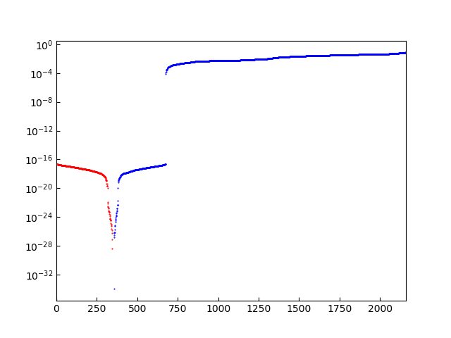

.. _direct_solution:

Direct solution of linearized phonon Boltzmann equation
========================================================

This page explains how to use the direct solution of LBTE by
`L. Chaput, Phys. Rev. Lett. 110, 265506 (2013)
<https://doi.org/10.1103/PhysRevLett.110.265506>`_ (:ref:`citation <citation_direct_solution_lbte>`).

.. contents::
   :depth: 2
   :local:

How to use
----------

As written in the following sections, this calculation requires large
memory space. When running multiple temperature points, simply the
memory space needed is multiplied by the number of the temperature
points. Therefore it is normally recommended to specify :ref:`--ts
option <ts_option>`. An example to run with the direct solution of
LBTE for ``example/Si-PBEsol`` is as follows::

   % phono3py --dim="2 2 2" --sym-fc -c POSCAR-unitcell
   ...

   % phono3py --dim="2 2 2" --pa="0 1/2 1/2 1/2 0 1/2 1/2 1/2 0" -c POSCAR-unitcell --mesh="11 11 11" --fc3 --fc2 --lbte --ts=300
   ...

   =================== End of collection of collisions ===================
   - Averaging collision matrix elements by phonon degeneracy [0.031s]
   - Making collision matrix symmetric (built-in) [0.000s]
   ----------- Thermal conductivity (W/m-k) with tetrahedron method -----------
   Diagonalizing by lapacke dsyev... [0.111s]
   Calculating pseudo-inv with cutoff=1.0e-08 (np.dot) [0.001s]
   #  T(K)        xx         yy         zz         yz         xz         xy
     300.0     111.588    111.588    111.588      0.000      0.000     -0.000
     (RTA)     109.009    109.009    109.009      0.000      0.000     -0.000
   ----------------------------------------------------------------------------

   Thermal conductivity and related properties were written into
   "kappa-m111111.hdf5".
   Eigenvalues of collision matrix were written into "coleigs-m111111.hdf5"
                    _
      ___ _ __   __| |
     / _ \ '_ \ / _` |
    |  __/ | | | (_| |
     \___|_| |_|\__,_|

Memory usage
-------------

The direct solution of LBTE needs diagonalization of a large collision
matrix, which requires large memory space.  This is the largest
limitation of using this method. The memory size needed for one
collision matrix at a temperature point is :math:`(\text{number of
irreducible grid points} \times \text{number of bands} \times 3)^2`
for the symmetrized collision matrix.

..
   and :math:`(\text{number of grid
   points} \times \text{number of bands})^2` for the non-symmetrized
   collision matrix.

These collision matrices contain real values and are supposed to be
64bit float symmetric matrices. During the diagonalization of each
collision matrix with LAPACK ``dsyev`` solver, around 1.2 times more
memory space is consumed in total.

When phono3py runs with :ref:`--wgp option <wgp_option>` together with
``--lbte`` option, estimated memory space needed for storing collision
matrix is presented. An example for ``example/Si-PBEsol`` is as follows::

   % phono3py --dim="2 2 2" --pa="0 1/2 1/2 1/2 0 1/2 1/2 1/2 0" -c POSCAR-unitcell --mesh="40 40 40" --wgp --lbte
   ...

   Memory requirements:
   - Piece of collision matrix at each grid point, temp and sigma: 0.00 Gb
   - Full collision matrix at each temp and sigma: 7.15 Gb
   - Phonons: 0.04 Gb
   - Grid point information: 0.00 Gb
   - Phonon properties: 0.14 Gb

   ...

With :ref:`--stp option <stp_option>`, estimated
memory space needed for ph-ph interaction strengths is shown.

Work load distribution
-----------------------

The other difficulty compared with RTA is the workload
distribution. Currently there are two ways to distribute the
calculation: (1) Collision matrix is divided and the pieces are
distributed into computing nodes. (2) Ph-ph interaction strengths at
grid points are distributed into computing nodes. These two can not be
mixed, so one of them has to be chosen. In either case, the
distribution is done simply running a set of phono3py calculations
over grid points and optionally band indices. The data computed on
each computing node are stored in an hdf5 file. Increasing the
calculation size, e.g., larger mesh numbers or larger number of atoms
in the primitive cell, large files are created.

.. _distribution_colmat:

Distribution of collision matrix
^^^^^^^^^^^^^^^^^^^^^^^^^^^^^^^^^

A full collision matrix is divided into pieces at grid points of
irreducible part of Brillouin zone. Each piece is calculated
independently from the other pieces. After finishing the calculations
of these pieces, the full collision matrix is diagonzalized to obtain
the thermal conductivity.

File size of Each piece of the collision matrix can be
large. Therefore it is recommended to use :ref:`--ts option
<ts_option>` to limit the number of temperature points, e.g.,
``--ts="100 200 300 400 500``, depending on the memory size installed
on each computing node. To write them into files,
``--write-collision`` option must be specified, and to read them from
files, ``--read-collision`` option is used. These are similarly used
as :ref:`--write-gamma <write_gamma_option>` and :ref:`--read-gamma
<read_gamma_option>` options for RTA calculation as shown in
:ref:`workload_distribution`.
``--read-collision`` option collects the pieces and make one full
collision matrix, then starts to diagonalize it. This option requires
one argument to specify an index to read the collision matrix at one
temperature point, e.g., the collision matrix at 200K is read with
``--read-collision=1`` for the (pieces of) collision matrices created
with ``--ts="100 200 300 400 500"`` (corresponding to 0, 1, 2, 3,
4). The temperature (e.g. 200K) is also read from the file, so it is
unnecessary to specify :ref:`--ts option <ts_option>` when reading.

The summary of the procedure is as follows:

1. Running at each grid point with :ref:`--gp <gp_option>` (or
   :ref:`--ga <ga_option>`) option and
   saving the piece of the collision matrix to an hdf5 file with
   ``--write-collision`` option. It is probably OK to calculate and
   store the pieces of the collision matrices at multiple temperatures
   though it depends on memory size of the computer node. This
   calculation has to be done at all irreducible grid points.
2. Collecting and creating all necessary pieces of the collision
   matrix with ``--read-collision=num`` (``num``: index of
   temperature). By this one full collision matrix at the selected
   temperature is created and then diagonalized. An option ``-o num``
   may be used together with ``--read-collision`` to distinguish the
   file names of the results at different temperatures.

Examples of command options are shown below using ``Si-PBE`` example.
Irreducible grid point indices are obtained by :ref:`--wgp option<wgp_option>`::

   % phono3py --dim="2 2 2" --pa="0 1/2 1/2 1/2 0 1/2 1/2 1/2 0" -c POSCAR-unitcell --mesh="19 19 19" --lbte --wgp

and the information is given in ``ir_grid_points.yaml``. For
distribution of collision matrix calculation (see also :ref:`workload_distribution`)::

   % phono3py --dim="2 2 2" --pa="0 1/2 1/2 1/2 0 1/2 1/2 1/2 0" -c POSCAR-unitcell --mesh="19 19 19" --fc3 --fc2 --lbte --ts=300 --write-collision --gp="grid_point_numbers..."

To collect distributed pieces of the collision matrix::

   % phono3py --dim="2 2 2" --pa="0 1/2 1/2 1/2 0 1/2 1/2 1/2 0" -c POSCAR-unitcell --mesh="19 19 19" --fc3 --fc2 --lbte --ts=300 --read-collision=0

Distribution of phonon-phonon interaction strengths
^^^^^^^^^^^^^^^^^^^^^^^^^^^^^^^^^^^^^^^^^^^^^^^^^^^^^

The distribution of pieces of collision matrix is straightforward and
is recommended to use if the number of temperature points is
small. However increasing data file size, network communication
becomes to require long time to send the files from a master node to
computation nodes. In this case, the distribution over ph-ph
interaction strengths can be another choice. Since, without using
:ref:`--full-pp option <full_pp_option>`, the tetrahedron method or
smearing approach with :ref:`--sigma-cutoff option
<sigma_cutoff_option>` results in the sparse ph-ph interaction
strength data array, i.e., most of the elements are zero, the data
size can be reduced by only storing non-zero elements. Not like the
collision matrix, the ph-ph interaction strengths in phono3py are
independent from temperature though it is not the case if the force
constants provided are temperature dependent. Once
stored, they are used to create the collision matrices at
temperatures. Using ``--write-pp`` and ``--read-pp``, they are written
into and read from hdf5 files at grid points.

It is also recommended to use :ref:`--write-phonon option
<write_phonon_option>` and :ref:`--read-phonon option
<read_phonon_option>` to use identical phonon eigenvectors among the
distributed nodes.

The summary of the procedure is as follows:

1. Running at each grid point with :ref:`--gp <gp_option>` (or
   :ref:`--ga <ga_option>`) option and storing the ph-ph interaction
   strengths to an hdf5 file with ``--write-pp`` option. This calculation
   has to be done at all irreducible grid points.
2. Running with ``--read-pp`` option and without :ref:`--gp <gp_option>` (or
   :ref:`--ga <ga_option>`) option. By this one full collision matrix at the
   selected temperature is created and then diagonalized. An option
   ``-o num`` may be used together with ``--read-collision`` to
   distinguish the file names of the results at different
   temperatures.

Examples of command options are shown below using ``Si-PBE`` example.
Irreducible grid point indices are obtained by :ref:`--wgp option<wgp_option>`::

   % phono3py --dim="2 2 2" --pa="0 1/2 1/2 1/2 0 1/2 1/2 1/2 0" -c POSCAR-unitcell --mesh="19 19 19" --lbte --wgp

and the grid point information is provided in
``ir_grid_points.yaml``. All phonons on mesh grid points are saved
by::

   % phono3py --dim="2 2 2" --pa="0 1/2 1/2 1/2 0 1/2 1/2 1/2 0" -c POSCAR-unitcell --mesh="19 19 19" --fc2 --write-phonon

For distribution of ph-ph interaction strength calculation (see also
:ref:`workload_distribution`)::

   % phono3py --dim="2 2 2" --pa="0 1/2 1/2 1/2 0 1/2 1/2 1/2 0" -c POSCAR-unitcell --mesh="19 19 19" --fc3 --fc2 --lbte --ts=300 --write-pp --gp="grid_point_numbers..." --read-phonon

Here one temperature has to be specified but any one of temperatures
is OK since ph-ph interaction strength computed here is assumed to be
temperature independent. Then the computed ph-ph interaction strengths
are read and used to compute collision matrix and lattice thermal
conductivity at a temperature by

::

   % phono3py --dim="2 2 2" --pa="0 1/2 1/2 1/2 0 1/2 1/2 1/2 0" -c POSCAR-unitcell --mesh="19 19 19" --fc3 --fc2 --lbte --ts=300 --read-pp --read-phonon

This last command is repeated at different temperatures to obtain the
properties at multiple temperatures.

.. _diagonzalization_solver:

Cutoff parameter of pseudo inversion
-------------------------------------

To achieve a pseudo inversion, a cutoff parameter is used to find null
space, i.e., to select the nearly zero eigenvalues. The default cutoff
value is ``1e-8``, and this hopefully works in many cases. But if a
collision matrix is numerically not very accurate, we may have to
carefully choose the value by ``--pinv-cutoff`` option. It is safer to
plot the absolute values of eigenvalues in log scale to see if there
is clear gap between non-zero eigenvalue and nearly-zero eigenvalues.
After running the direct solution of LBTE, ``coleigs-mxxx.hdf5`` is
created. This contains the eigenvalues of the collision matrix (either
symmetrized or non-symmetrized). The eigenvalues are plotted using
``phono3py-coleigplot`` in the phono3py package::

   phono3py-coleigplot coleigs-mxxx.hdf5

It is assumed that only one set of eigenvalues at a temperature point
is contained.

   Eigenvalues are plotted in log scale (Si-PBEsol exmaple with
   15x15x15 mesh). The number in x-axis is just the index where each
   eigenvalue is stored. Normally the eigenvalues are stored ascending
   order. The bule points show the positive values, and
   the red points show the negative values as positive values
   (absolute values) to be able to plot in log scale. In this plot, we
   can see the gap between :math:`10^{-4}` and :math:`10^{-16}`, which
   is a good sign. The values whose absolute values are smaller than
   :math:`10^{-8}` are treated as 0 and those solutions are considered
   as null spaces.

Installation of diagonalization solvers with multithreaded BLAS
---------------------------------------------------------------

Multithreaded BLAS is recommended to use for the calculation of the
direct solution of LBTE since the diagonalization of the collision
matrix is computationally demanding. A few examples of how to install
multithreded BLAS libraries are presented below.

MKL linked scipy
^^^^^^^^^^^^^^^^^^

Scipy (also numpy) has an interface to LAPACK dsyev
(``scipy.linalg.lapack.dsyev``). An MKL LAPACK linked scipy (also
numpy) gives very good computing performance and is easily obtained
using the anaconda package manager. In this choice, usual installation
of LAPACKE is necessary for running ``dgesvd`` and ``zheev``. When
using anaconda, installing OpenBLAS is the easiest way to do. See
:ref:`install_openblas_lapacke`

OpenBLAS or MKL via LAPACKE
^^^^^^^^^^^^^^^^^^^^^^^^^^^^^

Using LAPACKE via python C-API is implemented. By this, phono3py can
use LAPACK dsyev. This uses smaller memory space than using MKL linked
scipy. Practically there are two choices, OpenBLAS and MKL. For MKL,
proper installatin of the MKL package is necessary. The MKL
library installed obtained from anaconda can not be used.

OpenBLAS
~~~~~~~~~

Use of OpenBLAS is an easy choice if the anaconda package is used.
See :ref:`install_openblas_lapacke`.

MKL
~~~~

The BLAS multithread performance may be better in that in MKL. Using
MKL-LAPACK via MKL-LAPACKE via python C-API is also implemented if the
link is succeeded. See :ref:`install_mkl_lapacke`.

Solver choice for diagonalization
---------------------------------

For larger systems, diagonalization of collision matrix takes longest
time and requires large memory space. Phono3py relies on LAPACK for
the diagonalization and so the performance is dependent on the choice
of the diagonalization solver.

Using multithreaded BLAS with many-core computing node, computing time
may be well reduced and the calculation can finish in a realistic
time.  Currently scipy, numpy and LAPACKE can be used as the LAPACK
wrapper in phono3py. Scipy and numpy distributed by anaconda are MKL
linked, therefore MKL multithread BLAS is used through
them. Multithreaded OpenBLAS is installed by conda and can be used via
LAPACKE in phono3py. MKL LAPACK and BLAS are also able to be used via
LAPACKE in phono3py with appropriate setting in ``setup.py``.

Using ``--pinv-solver=[number]``, one of the following solver is
chosen:

1. Lapacke ``dsyev``: Smaller memory consumption than ``dsyevd``, but
   slower. This is the default solver when MKL LAPACKE is integrated or
   scipy is not installed.
2. Lapacke ``dsyevd``: Larger memory consumption than ``dsyev``, but
   faster. This is not recommended because sometimes a wrong result is
   obtained.
3. Numpy's ``dsyevd`` (``linalg.eigh``). This is not recommended
   because sometimes a wrong result is obtained.
4. Scipy's ``dsyev``: This is the default solver when scipy is
   installed and MKL LAPACKE is not integrated.
5. Scipy's ``dsyevd``. This is not recommended because sometimes a
   wrong result is obtained.

The solver choices other than ``--pinv-solver=1`` and
``--pinv-solver=4`` are dangerous and not recommend. They exist just
for the tests.
