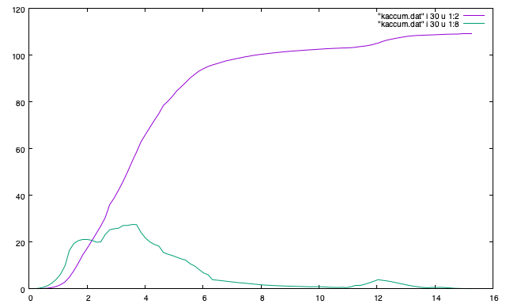
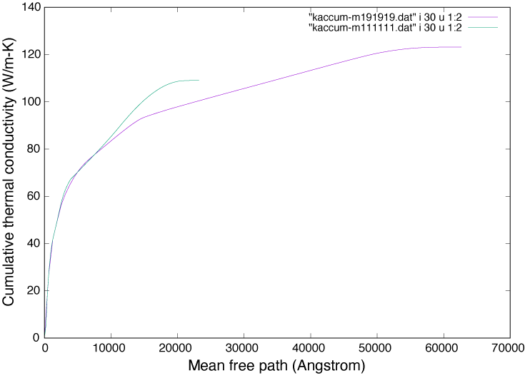
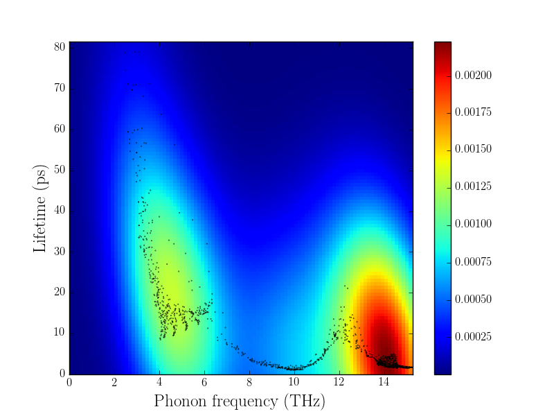

=======================================================
Welcome to phono3py
=======================================================

This software calculates phonon-phonon interaction and related
properties using the supercell approach. For example, the following
physical properties are obtained:

- Lattice thermal conductivity (RTA and :ref:`direct solution of LBTE
  <direct_solution>`)
- Phonon lifetime/linewidth
- Imaginary part of self energy
- Joint density of states (JDOS) and weighted-JDOS

Some papers that may introduce phono3py well:

- Theoretical background is summarized in this paper:
  http://dx.doi.org/10.1103/PhysRevB.91.094306 (arxiv
  http://arxiv.org/abs/1501.00691).
- Introduction to phono3py application:
  https://doi.org/10.1103/PhysRevB.97.224306 (open access).

The source code is found at https://github.com/phonopy/phono3py
(BSD-3-Clause). The code is written in Python extended with C and
written as:

- Works at least on Linux systems and MacOS easily.
- Each calculation is distributed over CPU-cores by OpenMP.
- Phonon lifetime (or ph-ph collision) calculations of respective
  phonon modes can be executed as independent calculations.
- Thermal conductivity calculations are highly efficiently
  distributed over nodes (see :ref:`workload_distribution`).
- User interfaces for :ref:`VASP <vasp_interface>`,
  :ref:`QE (pw) <qe_interface>`, :ref:`CRYSTAL <crystal_interface>`,
  :ref:`TURBOMOLE <turbomole_interface>`, and Abinit
  are built in (see :ref:`calculator_interfaces`).
- API is prepared to operate from Python script (`example
  <https://github.com/phonopy/phono3py/blob/master/example/Si-PBEsol/Si.py>`_)

Some tools to analyze the calculated results are prepared (see
:ref:`auxiliary_tools`).

|i0| |iMFP| |ikde|

Documentation
=============

.. toctree::
   :maxdepth: 1

   install
   examples
   Interfaces to calculators (VASP, QE, CRYSTAL, Abinit, TURBOMOLE) <interfaces>
   command-options
   output-files
   hdf5_howto
   auxiliary-tools
   direct-solution
   workload-distribution
   cutoff-pair
   external-tools
   tips
   citation
   changelog

Mailing list
============

For questions, bug reports, and comments, please visit following
mailing list:

https://lists.sourceforge.net/lists/listinfo/phonopy-users

Message body including attached files has to be smaller than 300 KB.

License
=======

BSD-3-Clause (New BSD)

Contact
=======

* Author: `Atsushi Togo <http://atztogo.github.io/>`_
