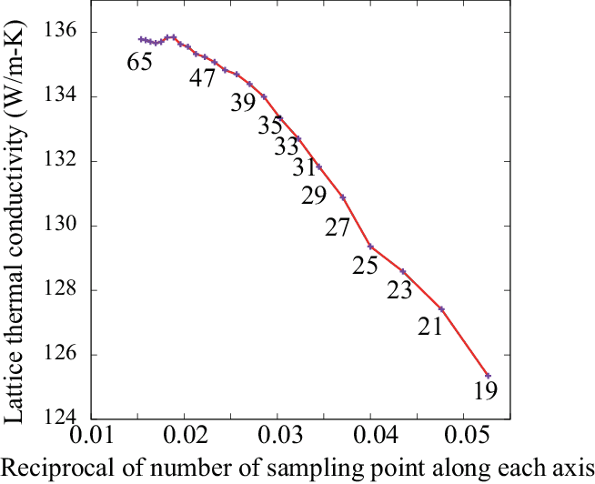

.. _tips:

Tips
=====

.. contents::
   :depth: 2
   :local:

.. _brillouinzone_sum:

Brillouin zone summation
-------------------------

Brillouin zone (BZ) summations appear at different two points in
phonon lifetime calculation. First it is used for the Fourier
transform of force constants, and second to obtain imaginary part of
phonon-self-energy. For the summation, usually uniform sampling meshes
are employed. To obtain more accurate result, it is always better to
use denser meshes. But the denser mesh requires more computational
demand.

The second BZ summation contains delta functions. In
phono3py calculation, a linear tetrahedron method (:ref:`thm option
<thm_option>`, default option) and a smearing method (:ref:`sigma
option <sigma_option>`) can be used for this BZ
integration. In most cases, the tetrahedron method is better. Especially in high
thermal conductivity materials, the smearing method results in
underestimation of lattice thermal conductivity.

The figure below shows Si thermal conductivity convergence with
respect to number of mesh points along an axis from n=19 to 65. This
is calculated with RTA and the linear tetrahedron method. Within the
methods and phono3py implementation, it is converging at around n=55,
however this computational demand is not trivial. As far as observing
this result, an extrapolation to :math:`1/n \rightarrow 0` seems not a
good idea, since it gives overestimation in the case of this Si
example. This plot tells that we have to decide how much value is
acceptable as lattice thermal conductivity value. Therefore it
important to describe the number of sampling mesh and method of BZ
integration to let other people reproduce the computational results.

|isiconv|

In case the smearing method is necessary to use, the convergence of
q-point mesh together with smearing width has to be checked
carefully. Since smearing parameter is used to approximate delta
functions, small ``sigma`` value is better to describe the detailed
structure of three-phonon-space, however it requires a denser sampling
mesh to converge the result. To check the convergence with respect to
the ``sigma`` value, multiple sigma values can be set. This can be
computationally efficient, since it is avoided to re-calculate
phonon-phonon interaction strength for different ``sigma`` values in
this case. Convergence with respect to the sampling mesh and smearing
parameter strongly depends on materials. For Si example, a
:math:`20\times 20\times 20` sampling mesh (or 8000 reducible sampling
points) and 0.1 THz smearing value for reciprocal of the volume of an
atom may be a good starting choice. The tetrahedron method requires no
such parameter as the smearing width.

Importance of numerical quality of force constants
---------------------------------------------------

Third-order force constants (fc3) are much weaker to numerical noise
of a force calculator than second-order force constants
(fc2). Therefore supercell force calculations have to be done very
carefully.

Numerical quality of forces given by force calculators is the most
important factor for the numerical quality of lattice thermal
conductivity calculation. We may be able to apply symmetry constraints
to force constants, however even if force constants fulfill those
symmetries, the numerical quality of force constants is not guaranteed
since elements of force constants just suffice the symmetries but most
of those intensities are not constrained.

It is important to use the best possible force calculator in the
possibly best way. The knowledge of the force calculator from the
theory and method to the practical usage is required to obtain
good results of lattice thermal conductivity calculation.

In the following, a few things that may be good to know are
presented.

A practical way to check lattice thermal conductivity result
~~~~~~~~~~~~~~~~~~~~~~~~~~~~~~~~~~~~~~~~~~~~~~~~~~~~~~~~~~~~

Some feeling whether our calculation result is OK or not may be
obtained by comparing lattice thermal conductivities calculated with
and without :ref:`symmetrizations of force constants
<symmetrization_option>`. If they are enough different, e.g., more
than twice different, it is better to re-consider about the force
calculation. In the case of DFT calculations, the choice of input
settings such as k-point sampling mesh, plane-wave energy cutoff, and
exchange-correlational potential, etc, should be reconsidered.

Displacement distance of atoms
~~~~~~~~~~~~~~~~~~~~~~~~~~~~~~~

The phono3py default displacement distance is 0.03
:math:`\text{Angstrom}`. In some cases, accurate result may not be obtained
due to the numerical noise of the force calculator. Usually increasing
the displacement distance by the :ref:`amplitude option
<amplitude_option>` reduces the numerical noise, but as its drawback
higher order anharmonicity is involved (renormalized) into fc3 and fc2.

.. _file_format_compatibility:

File format compatibility with phonopy
---------------------------------------

- ``disp_fc3.yaml`` and ``disp_fc2.yaml`` are not compatible with
  phonopy's ``phonopy_disp.yaml``.
- ``FORCES_FC3`` and ``FORCES_FC2`` are not
  compatible with phonopy's ``FORCE_SETS``.
- ``FORCE_SETS`` can be created using :ref:`--cfs <cfs_option>` from
  ``FORCES_FC3`` and ``disp_fc3.yaml`` or ``FORCES_FC2`` and
  ``disp_fc2.yaml`` (needs to specify ``--dim-fc2``).
- ``FORCES_FC2`` and ``disp_fc2.yaml`` can be created using :ref:`--fs2f2
  <fs2f2_option>` from ``FORCE_SETS``.
- ``fc2.hdf5`` can be used in phonopy in the ``hdf5`` mode when it is
  renamed to ``force_constants.hdf5``. In the previous combinations of
  phonopy and phono3py, depending on the physical unit of force
  constants of calculators, the direct compatibility is not guranteed.
